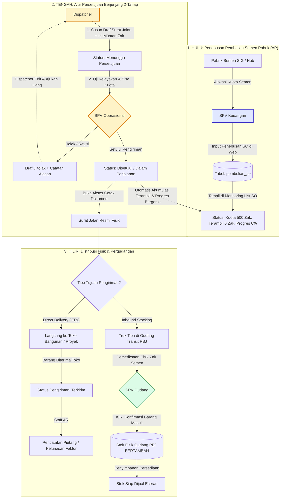

# Panduan Alur Distribusi Semen & Skenario Pengujian Tim (Hulu ke Hilir)
**Proyek:** Sistem Informasi Akuntansi & Distribusi Semen PT Putra Balkom Jaya (PBJ)  
**Tujuan Dokumen:** Standar Operasional Prosedur (SOP) digital dari penebusan pabrik, alur persetujuan pengiriman berjenjang, hingga penerimaan fisik pergudangan untuk pengujian tim pengembang dan manajemen.

---

## 1. Konsep Arsitektur Rantai Pasok (Hulu ke Hilir)

Alur distribusi semen PT PBJ mengintegrasikan 4 tahapan utama:
1. **Hulu (Keuangan AP)**: Penebusan kuota pembelian ke produsen semen (Plant Pabrik SIG) -> Diterbitkan Sales Order (SO) & Loading Order (LO).
2. **Tengah (Operasional Logistik)**: Pembuatan draf penugasan armada oleh Dispatcher -> Validasi & persetujuan berjenjang oleh **SPV Operasional**.
3. **Pabrik & Perjalanan**: Pemotongan kuota SO secara real-time di pabrik -> Cetak Surat Jalan resmi -> Armada truk berangkat.
4. **Hilir (Pergudangan & Pelanggan)**:
   - **Jalur Direct Delivery (FRC)**: Semen diantar langsung ke toko bangunan/proyek pelanggan.
   - **Jalur Inbound Stocking (Transit Gudang)**: Semen diturunkan di gudang transit PBJ -> **SPV Gudang** memeriksa fisik semen dan mengonfirmasi penerimaan barang masuk -> **Stok Gudang Bertambah**.

---

## 2. Diagram Visualisasi Alur Sistem (Mermaid)

---

## 3. Matriks Peran, Kredensial Pengujian, & Wewenang

| Peran (Role) | Username | Password Default | Wewenang Utama | Batasan Ketat |
|---|---|---|---|---|
| **SPV Keuangan** | `spv_keuangan` | `password123` | Penebusan SO pabrik, monitoring kuota SO, pengeluaran kas, buku jurnal. | Tidak dapat menyetujui keberangkatan truk logistik. |
| **Dispatcher** | `dispatcher` | `password123` | Membuat draf penugasan Surat Jalan, memilih supir & truk, menentukan jumlah zak muatan. | **Hanya membuat draf (`menunggu`)**. Tidak bisa menyetujui draf buatannya sendiri. Tidak bisa cetak sebelum disetujui. |
| **SPV Operasional** | `spv_operasional` | `password123` | **Satu-satunya peran** yang berwenang menekan tombol **Setujui Pengiriman** atau **Tolak / Minta Revisi**. | Tidak mengurusi pembuatan akun login pengguna. |
| **SPV Gudang** | `spv_gudang` | `password123` | Monitoring stok persediaan semen, verifikasi fisik, dan eksekusi **Konfirmasi Barang Masuk/Keluar**. | Tidak mengurusi pencatatan akuntansi keuangan. |
| **Super Admin** | `superadmin` | `password123` | Pengelolaan data akun staf pengguna dan reset kata sandi. | **Khusus kelola akun**. Dilarang intervensi approval pengiriman. |
| **Direktur & Manager** | `direktur` | `password123` | Pemantauan laporan eksekutif Neraca dan Laba Rugi (*Read-Only*). | Tidak mengurusi approval teknis harian. |

---

## 4. Panduan Skenario Pengujian Tim (Step-by-Step Testing Guide)

Lakukan pengujian secara berurutan bersama tim untuk memverifikasi alur terintegrasi:

### Skenario 1: Penebusan Kuota Pembelian SO (Hulu)
1. Buka browser dan login menggunakan akun:
   - **Username:** `spv_keuangan`
   - **Password:** `password123`
2. Masuk ke menu **Keuangan & AP -> Pembelian SO** (`/keuangan/ap/pembelian-so`).
3. Klik tombol **+ Input Penebusan SO**.
4. Isi formulir:
   - Customer: Pilih customer (misal *TB Maju Jaya Sentosa*).
   - Gudang/Plant Penebusan: *Gudang Hub Cikampek (Plant Karawang)*.
   - Tanggal SO: Hari ini.
   - Jumlah Zak: `500`.
   - Harga Satuan: `55000`.
5. Klik **Simpan**.
6. **Hasil Verifikasi**:
   - Muncul notifikasi sukses dan nomor SO terbit (misal `SO-PBJ-20260905-001`).
   - Buka menu **List SO** (`/keuangan/ap/list-so`). Baris SO baru berstatus:
     - Kuota SO: `500 Zak`
     - Terambil: `0 Zak`
     - Sisa Kuota: `500 Zak`
     - Progres: `0%`

---

### Skenario 2: Pengajuan Draf Surat Jalan oleh Dispatcher
1. Logout, lalu login menggunakan akun:
   - **Username:** `dispatcher`
   - **Password:** `password123`
2. Masuk ke menu **Operasional -> Pengiriman (Surat Jalan)** (`/operasional/pengiriman/surat-jalan`).
3. Klik tombol **+ Buat Surat Jalan Baru**.
4. **Uji Validasi Strict Guard (Batas Kuota)**:
   - Pilih nomor SO yang baru dibuat di atas (`SO-PBJ-20260905-001`).
   - Perhatikan info sisa kuota yang muncul: `Sisa Kuota: 500 Zak`.
   - Masukkan Jumlah Zak: `600` (melebihi kuota 500).
   - Klik Simpan -> Sistem wajib menolak dengan peringatan merah: *"Jumlah muatan melebihi sisa kuota SO yang tersedia."*
5. **Input Draf Valid**:
   - Ubah Jumlah Zak menjadi: `200`.
   - Pilih Armada Truk dan Driver.
   - Klik **Simpan Pengiriman**.
6. **Hasil Verifikasi**:
   - Baris pengiriman baru terdaftar dengan status warna kuning: **Menunggu Persetujuan SPV**.
   - Kolom Aksi **TIDAK MENAMPILKAN** tombol 'Setujui Pengiriman' (karena peran Dispatcher tidak berhak menyetujui).
   - Tombol 'Cetak Surat Jalan' dalam kondisi non-aktif / terkunci.

---

### Skenario 3: Validasi, Revisi, & Persetujuan oleh SPV Operasional
1. Logout, lalu login menggunakan akun:
   - **Username:** `spv_operasional`
   - **Password:** `password123`
2. Masuk ke menu **Operasional -> Pengiriman (Surat Jalan)** (`/operasional/pengiriman/surat-jalan`).
3. Periksa baris pengiriman berstatus `Menunggu Persetujuan SPV` tadi.
4. Klik tombol aksi tiga titik (`•••`):
   - **Uji Fitur Penolakan/Revisi**:
     - Klik **Tolak / Minta Revisi**, masukkan catatan: *"Ganti unit truk karena armada sedang dalam servis berkala."*
     - Status berubah menjadi **Ditolak / Perlu Revisi**.
     - Login kembali sebagai Dispatcher untuk mengganti truk, lalu ajukan ulang.
   - **Uji Fitur Persetujuan (Approval)**:
     - Klik tombol **Setujui Pengiriman**.
5. **Hasil Verifikasi**:
   - Status pengiriman berubah menjadi warna biru: **Disetujui / Dalam Perjalanan**.
   - Tercatat keterangan riwayat: *Disetujui oleh: spv_operasional pada (tanggal & jam)*.
   - Tombol **Cetak Surat Jalan** kini aktif dan dokumen resmi 3 rangkap ber-kop PT PBJ dapat dicetak.
   - Armada truk otomatis berstatus *Dalam Pengiriman* dan supir berstatus *Jalan*.

---

### Skenario 4: Pemotongan Kuota Otomatis pada Monitoring List SO
1. Tetap login atau login sebagai `spv_keuangan`.
2. Buka menu **Keuangan & AP -> List SO** (`/keuangan/ap/list-so`).
3. Periksa baris SO yang digunakan tadi (`SO-PBJ-20260905-001`):
   - **Kuota SO:** `500 Zak`
   - **Terambil:** Bertambah otomatis menjadi `200 Zak`
   - **Sisa Kuota:** Berkurang menjadi `300 Zak`
   - **Progres:** Melonjak otomatis dari 0% menjadi **40%** (batang progres terisi warna biru).

---

### Skenario 5: Konfirmasi Fisik Barang Masuk oleh SPV Gudang (Inbound Gudang PBJ)
1. Logout, lalu login menggunakan akun:
   - **Username:** `spv_gudang`
   - **Password:** `password123`
2. Masuk ke menu **Operasional -> Gudang & Stok** (`/operasional/gudang/stok`).
3. Untuk pengiriman yang bertujuan mengisi gudang transit PBJ:
   - Klik aksi pada fasilitas gudang tujuan (misal *Gudang Hub Cikampek*).
   - Klik tombol **Konfirmasi Penerimaan Barang Masuk (200 Zak)** sesuai nomor Surat Jalan yang telah disetujui.
4. **Hasil Verifikasi**:
   - Angka **Stok Tersedia** pada gudang bertambah persis sebanyak 200 zak.
   - Tercatat riwayat mutasi penerimaan barang masuk dari Surat Jalan terkait.
